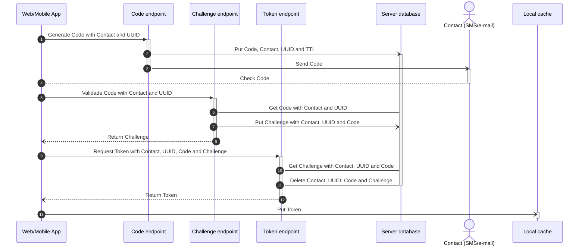
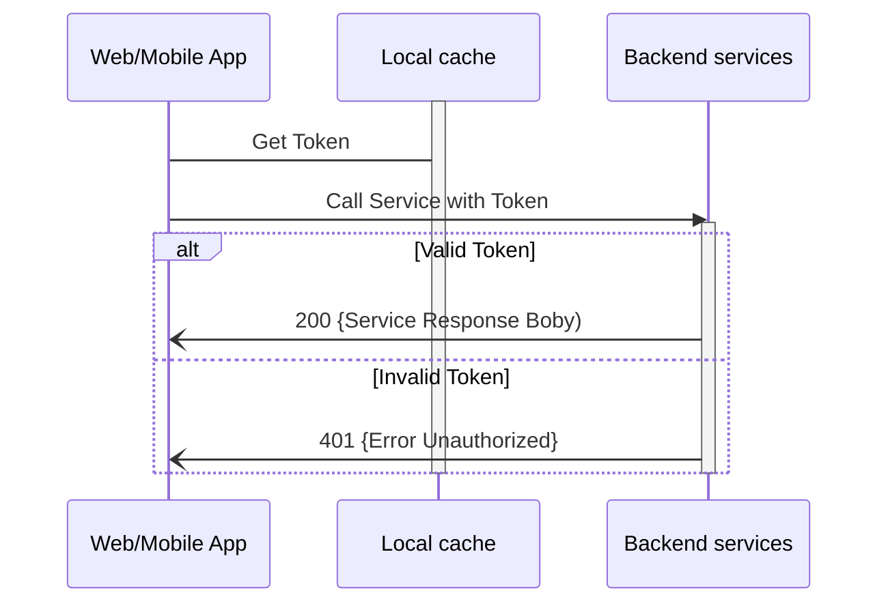

# Brief Box Back-end Serverless Services


## Authentication

- Token Type: [JSON Web Token](https://jwt.io)
- Token Expiration: 24 hours
- Code Format: 999 999 (space insensitive)

**Authentication Sequence Diagram**



**Backend Service Sequence Diagram**



## Development

To create a virtualenv:

```
$ python3 -m venv .venv
$ .venv/bin/pip install -r requirements.txt
```

Useful commands:

 * `cdk ls`          list all stacks in the app
 * `cdk synth`       emits the synthesized CloudFormation template
 * `cdk deploy`      deploy this stack to your default AWS account/region
 * `cdk diff`        compare deployed stack with current state
 * `cdk docs`        open CDK documentation
